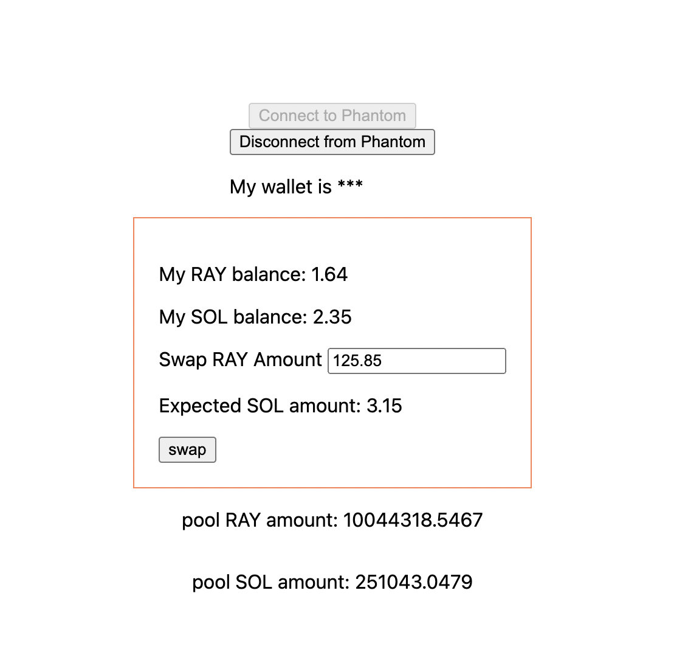

## A simple RAY-SOL swap interface

Features

-   [x] Connect to Phantom Wallet
-   [x] Show RAY and SOL balance
-   [x] Show quote from RAY to SOL
-   [x] Show pool RAY and SOL balance
-   [ ] Swap from RAY to SOL

Note: This is a very simple interface for I am not able to compose parameters for `Trade.makeTradeTransaction`. Trade isn't working yet.

## Preview



---

This is a [Next.js](https://nextjs.org/) project bootstrapped with [`create-next-app`](https://github.com/vercel/next.js/tree/canary/packages/create-next-app).

## Getting Started

First, run the development server:

```bash
yarn dev
```

Open [http://localhost:3000](http://localhost:3000) with your browser to see the result.
